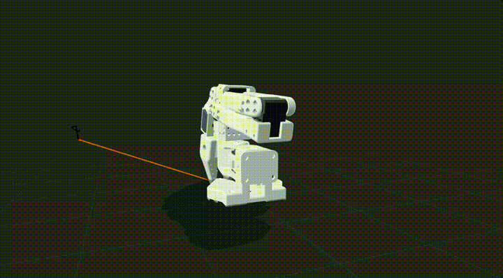
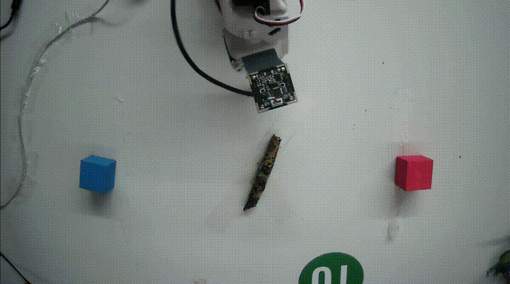
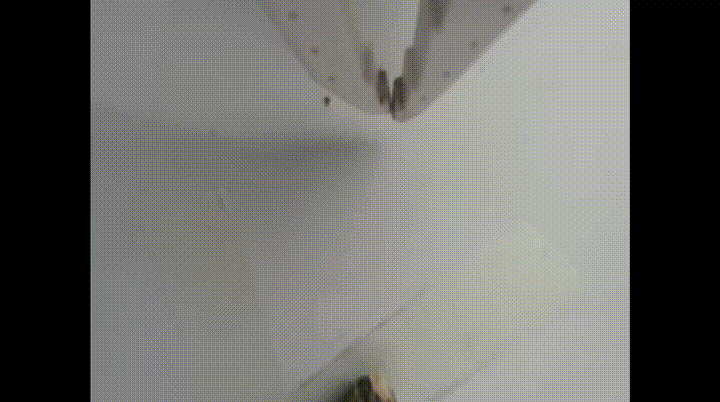
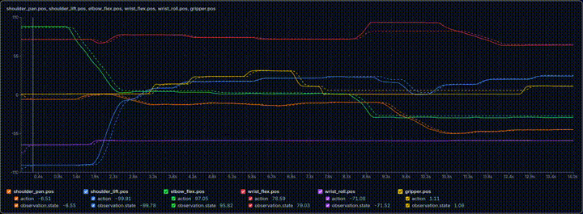

# Organic Waste Sorting with LeRobot

Robotic organic/non-organic waste sorting using a real SO-101 leader/follower arm setup, Hugging Face LeRobot, imitation learning, ACT, Diffusion Policy, and SmolVLA experiments.

The goal of this project is to teach a robot arm to sort objects into the correct waste bin:

- **Chocolate bar** → **blue non-organic bin**
- **Branch** → **red organic bin**

This repository documents the full process from hardware setup to policy rollout:

```text
setup → calibration → teleoperation → camera integration → data collection → Hugging Face dataset upload → ACT training → Diffusion Policy training → SmolVLA training → real robot rollout
```

---

## Final Demonstration

### Diffusion Policy: Branch → Red Organic Bin

The branch policy was trained with Diffusion Policy using wrist-camera observations. It produced smoother behavior than ACT and performed better during physical rollout than SmolVLA.

https://github.com/user-attachments/assets/ac470607-a84f-4dcd-8528-1186baf9404c

---

### Diffusion Policy: Chocolate Bar → Blue Non-Organic Bin

The chocolate policy was trained with Diffusion Policy using wrist-camera observations.

https://github.com/user-attachments/assets/55ee6f85-ef9c-47c1-807d-ca6abe084526

---

## Dataset Demonstration: Episode 30

Episode 30 shows the branch sorting task:

> Place branch on the red organic bin.

The episode was recorded in LeRobot format with synchronized camera observations, robot states, actions, and task labels.

### 3D View



### Front Camera



### Wrist Camera



### Joint State / Action Graphs



---

## Project Summary

| Component | Status |
|---|---|
| SO-101 follower setup | Complete |
| SO-101 leader setup | Complete |
| Follower calibration | Complete |
| Leader calibration | Complete |
| Teleoperation | Working |
| Teleoperation with cameras | Working |
| Dataset recording | Complete |
| Hugging Face dataset upload | Complete |
| ACT baseline training | Complete |
| ACT rollout | Working, but grasp unreliable |
| Diffusion Policy training | Complete |
| Diffusion rollout | Best-performing policy |
| SmolVLA | Experimental |

---

## Hardware Setup

The project used:

- SO-101 follower robotic arm
- SO-101 leader teleoperation arm
- Front OpenCV camera
- Wrist OpenCV camera
- Ubuntu/Linux workstation
- NVIDIA GPU for training
- Hugging Face LeRobot

Camera setup:

```text
front camera:
  device: /dev/video0
  resolution: 1920x1080
  fps: 5

wrist camera:
  device: /dev/video2 or /dev/video3 depending on Linux camera mapping
  resolution: 640x480
  fps during recording: 30
```

Camera device numbers changed between runs, so we used:

```bash
lerobot-find-cameras opencv
```

and also checked stable Linux camera paths with:

```bash
v4l2-ctl --list-devices
ls -l /dev/v4l/by-id/
```

Using `/dev/v4l/by-id/...` is more stable than relying only on `/dev/video2` or `/dev/video3`.

---

## Environment Setup

Clone LeRobot:

```bash
git clone https://github.com/huggingface/lerobot.git
cd lerobot
```

Install LeRobot:

```bash
pip install -e .
```

For SmolVLA experiments:

```bash
pip install -e ".[smolvla]"
```

Login to Hugging Face:

```bash
hf auth login
```

Set the project variables:

```bash
export HF_USER=Hugo132645
export DATASET_REPO_ID=Hugo132645/OW_Dataset_20260606_230614
export PYTORCH_CUDA_ALLOC_CONF=expandable_segments:True
```

---

## Robot Port Discovery

We used:

```bash
lerobot-find-port
```

Typical ports:

```text
follower: /dev/ttyACM0 or /dev/ttyACM1
leader:   /dev/ttyACM0 or /dev/ttyACM1
```

The exact port changed depending on USB order.

---

## Follower Calibration

The follower arm was calibrated with:

```bash
lerobot-calibrate \
  --robot.type=so101_follower \
  --robot.port=/dev/ttyACM0 \
  --robot.id=FOLLOWER \
  --robot.calibration_dir=configs/calibration/robots
```

If the follower appeared on the other port:

```bash
--robot.port=/dev/ttyACM1
```

The calibration was saved in:

```text
configs/calibration/robots
```

---

## Leader Calibration

The leader arm was calibrated with:

```bash
lerobot-calibrate \
  --teleop.type=so101_leader \
  --teleop.port=/dev/ttyACM1 \
  --teleop.id=LEADER \
  --teleop.calibration_dir=configs/calibration/teleoperators
```

If the leader appeared on the other port:

```bash
--teleop.port=/dev/ttyACM0
```

The calibration was saved in:

```text
configs/calibration/teleoperators
```

---

## Basic Teleoperation

After calibration, we tested leader/follower teleoperation without cameras:

```bash
lerobot-teleoperate \
  --robot.type=so101_follower \
  --robot.port=/dev/ttyACM0 \
  --robot.id=FOLLOWER \
  --robot.calibration_dir=configs/calibration/robots \
  --teleop.type=so101_leader \
  --teleop.port=/dev/ttyACM1 \
  --teleop.id=LEADER \
  --teleop.calibration_dir=configs/calibration/teleoperators \
  --display_data=false
```

This confirmed that leader-arm motion controlled the follower arm correctly.

---

## Camera Discovery and Testing

We detected cameras with:

```bash
lerobot-find-cameras opencv
```

We also tested cameras manually using OpenCV:

```python
import cv2

cam = "/dev/video3"

cap = cv2.VideoCapture(cam, cv2.CAP_V4L2)
cap.set(cv2.CAP_PROP_FRAME_WIDTH, 640)
cap.set(cv2.CAP_PROP_FRAME_HEIGHT, 480)
cap.set(cv2.CAP_PROP_FPS, 30)

print("opened:", cap.isOpened())

ret, frame = cap.read()
print("read:", ret)

if ret:
    print("frame shape:", frame.shape)

cap.release()
```

This helped confirm which `/dev/videoX` path corresponded to the usable camera stream.

---

## Teleoperation with Cameras

We then tested teleoperation with both the front and wrist cameras:

```bash
lerobot-teleoperate \
  --robot.type=so101_follower \
  --robot.port=/dev/ttyACM0 \
  --robot.id=FOLLOWER \
  --robot.calibration_dir=configs/calibration/robots \
  --robot.cameras='{
    front: {type: opencv, index_or_path: /dev/video0, width: 1920, height: 1080, fps: 5, warmup_s: 3},
    wrist: {type: opencv, index_or_path: /dev/video3, width: 640, height: 480, fps: 30, warmup_s: 3}
  }' \
  --teleop.type=so101_leader \
  --teleop.port=/dev/ttyACM1 \
  --teleop.id=LEADER \
  --teleop.calibration_dir=configs/calibration/teleoperators \
  --display_data=true
```

This confirmed that both cameras could be used during robot teleoperation.

---

## Dataset Recording

The dataset was recorded with real teleoperated demonstrations.

Each episode contains:

- robot actions
- robot joint states
- front camera video
- wrist camera video
- task language instruction
- episode metadata

Final Hugging Face dataset:

```text
Hugo132645/OW_Dataset_20260606_230614
```

### Task 1: Chocolate Bar → Blue Non-Organic Bin

```bash
python src/lerobot/scripts/lerobot_record.py \
  --resume=true \
  --robot.type=so101_follower \
  --robot.port=/dev/ttyACM0 \
  --robot.id=FOLLOWER \
  --robot.calibration_dir=configs/calibration/robots \
  --robot.cameras='{
    front: {type: opencv, index_or_path: /dev/video0, width: 1920, height: 1080, fps: 5, warmup_s: 3},
    wrist: {type: opencv, index_or_path: /dev/video3, width: 640, height: 480, fps: 30, warmup_s: 3}
  }' \
  --teleop.type=so101_leader \
  --teleop.port=/dev/ttyACM1 \
  --teleop.id=LEADER \
  --teleop.calibration_dir=configs/calibration/teleoperators \
  --dataset.repo_id=Hugo132645/OW_Dataset_20260606_230614 \
  --dataset.root=data \
  --dataset.num_episodes=30 \
  --dataset.single_task="Place chocolate bar on the blue non-organic bin." \
  --dataset.push_to_hub=true \
  --display_data=false
```

Make sure that on the first run --resume is set to false.

### Task 2: Branch → Red Organic Bin

```bash
python src/lerobot/scripts/lerobot_record.py \
  --resume=true \
  --robot.type=so101_follower \
  --robot.port=/dev/ttyACM0 \
  --robot.id=FOLLOWER \
  --robot.calibration_dir=configs/calibration/robots \
  --robot.cameras='{
    front: {type: opencv, index_or_path: /dev/video0, width: 1920, height: 1080, fps: 5, warmup_s: 3},
    wrist: {type: opencv, index_or_path: /dev/video3, width: 640, height: 480, fps: 30, warmup_s: 3}
  }' \
  --teleop.type=so101_leader \
  --teleop.port=/dev/ttyACM1 \
  --teleop.id=LEADER \
  --teleop.calibration_dir=configs/calibration/teleoperators \
  --dataset.repo_id=Hugo132645/OW_Dataset_20260606_230614 \
  --dataset.root=data \
  --dataset.num_episodes=30 \
  --dataset.single_task="Place branch on the red organic bin." \
  --dataset.push_to_hub=true \
  --display_data=false
```

---

## Dataset Verification

We verified the dataset with:

```bash
python - <<'PY'
from lerobot.datasets.lerobot_dataset import LeRobotDataset
from collections import Counter

repo_id = "Hugo132645/OW_Dataset_20260606_230614"
ds = LeRobotDataset(repo_id)

print("Dataset:", repo_id)
print("Frames:", ds.num_frames)
print("Episodes:", ds.num_episodes)

print("\nTasks:")
print(ds.meta.tasks)

counts = Counter()
for ep in ds.meta.episodes:
    tasks = ep["tasks"]
    if isinstance(tasks, list):
        for task in tasks:
            counts[task] += 1
    else:
        counts[str(tasks)] += 1

print("\nTask counts:")
for task, count in counts.items():
    print(count, "episodes:", task)
PY
```

Final dataset statistics:

```text
Frames: 17,530
Episodes: 60

30 episodes: Place chocolate bar on the blue non-organic bin.
30 episodes: Place branch on the red organic bin.
```

Dataset features:

```text
action: 6 robot joints
observation.state: 6 robot joints
observation.images.front: 1920x1080 RGB video
observation.images.wrist: 640x480 RGB video
timestamp
frame_index
episode_index
task_index
```

---

## Hugging Face Dataset Visualization

The dataset was uploaded to Hugging Face:

```text
Hugo132645/OW_Dataset_20260606_230614
```

It can be visualized with the LeRobot dataset visualizer:

```text
https://huggingface.co/spaces/lerobot/visualize_dataset
```

Local dataset visualization:

```bash
lerobot-dataset-viz \
  --dataset.repo_id=Hugo132645/OW_Dataset_20260606_230614
```

---

## ACT Baseline

ACT was trained first as a baseline imitation learning policy.

```bash
lerobot-train \
  --dataset.repo_id=${DATASET_REPO_ID} \
  --policy.type=act \
  --output_dir=outputs/train/act_food_sorting_baseline_20k \
  --job_name=act_food_sorting_baseline_20k \
  --policy.device=cuda \
  --wandb.enable=false \
  --steps=20000 \
  --batch_size=1 \
  --num_workers=0 \
  --log_freq=200 \
  --save_checkpoint=true \
  --save_freq=5000 \
  --policy.repo_id=${HF_USER}/act_food_sorting_baseline_20k \
  --policy.push_to_hub=false \
  --policy.use_amp=true \
  --policy.use_vae=true \
  --policy.chunk_size=50 \
  --policy.n_action_steps=50
```
I recommend doing a debug step before committing to the training.

Final ACT checkpoint:

```text
outputs/train/act_food_sorting_baseline_20k/checkpoints/last/pretrained_model
```

### ACT Rollout

```bash
lerobot-rollout \
  --policy.path=outputs/train/act_food_sorting_baseline_20k/checkpoints/last/pretrained_model \
  --robot.type=so101_follower \
  --robot.port=/dev/ttyACM0 \
  --robot.id=FOLLOWER \
  --robot.calibration_dir=configs/calibration/robots \
  --robot.cameras='{
    front: {type: opencv, index_or_path: /dev/video0, width: 1920, height: 1080, fps: 5, warmup_s: 3},
    wrist: {type: opencv, index_or_path: /dev/video3, width: 640, height: 480, fps: 30, warmup_s: 3}
  }' \
  --task="Place chocolate bar on the blue non-organic bin." \
  --fps=10 \
  --display_data=false
```

ACT loaded and controlled the robot, but it was not reliable enough for the final demonstration. The arm trembled and did not consistently grasp the object.

---

## Diffusion Policy

Diffusion Policy was trained after ACT because it produced smoother action trajectories.

In our LeRobot version, Diffusion Policy required image observations to have matching shapes. The full dataset used different camera resolutions:

```text
front: 1920x1080
wrist: 640x480
```

Because of this, we trained wrist-camera-only diffusion policies.

### Chocolate Bar → Blue Bin

```bash
lerobot-train \
  --dataset.repo_id=${DATASET_REPO_ID} \
  --dataset.episodes='[0,1,2,3,4,5,6,7,8,9,10,11,12,13,14,15,16,17,18,19,20,21,22,23,24,25,26,27,28,29]' \
  --policy.type=diffusion \
  --output_dir=outputs/train/diffusion_chocolate_blue_wrist_30k \
  --job_name=diffusion_chocolate_blue_wrist_30k \
  --policy.device=cuda \
  --wandb.enable=false \
  --steps=30000 \
  --batch_size=1 \
  --num_workers=0 \
  --log_freq=200 \
  --save_checkpoint=true \
  --save_freq=5000 \
  --policy.repo_id=${HF_USER}/diffusion_chocolate_blue_wrist_30k \
  --policy.push_to_hub=false \
  --policy.use_amp=true \
  --policy.horizon=16 \
  --policy.n_action_steps=8 \
  --policy.num_inference_steps=10 \
  --policy.resize_shape='[240,320]' \
  --policy.input_features='{
    observation.state: {type: STATE, shape: [6]},
    observation.images.wrist: {type: VISUAL, shape: [3, 480, 640]}
  }' \
  --policy.output_features='{
    action: {type: ACTION, shape: [6]}
  }'
```

Rollout:

```bash
lerobot-rollout \
  --policy.path=outputs/train/diffusion_chocolate_blue_wrist_30k/checkpoints/last/pretrained_model \
  --robot.type=so101_follower \
  --robot.port=/dev/ttyACM0 \
  --robot.id=FOLLOWER \
  --robot.calibration_dir=configs/calibration/robots \
  --robot.cameras='{
    wrist: {type: opencv, index_or_path: /dev/video3, width: 640, height: 480, fps: 30, warmup_s: 3}
  }' \
  --task="Place chocolate bar on the blue non-organic bin." \
  --fps=10 \
  --display_data=false
```

### Branch → Red Bin

A direct training attempt with episodes `30–59` caused an indexing issue, so we created a branch-only dataset by deleting episodes `0–29`.

```bash
export BRANCH_DATASET=${HF_USER}/OW_Dataset_branch_red_only
```

```bash
lerobot-edit-dataset \
  --repo_id=${DATASET_REPO_ID} \
  --new_repo_id=${BRANCH_DATASET} \
  --operation.type=delete_episodes \
  --operation.episode_indices='[0,1,2,3,4,5,6,7,8,9,10,11,12,13,14,15,16,17,18,19,20,21,22,23,24,25,26,27,28,29]' \
  --push_to_hub=true
```

Train branch diffusion policy:

```bash
lerobot-train \
  --dataset.repo_id=${BRANCH_DATASET} \
  --policy.type=diffusion \
  --output_dir=outputs/train/diffusion_branch_red_wrist_30k \
  --job_name=diffusion_branch_red_wrist_30k \
  --policy.device=cuda \
  --wandb.enable=false \
  --steps=30000 \
  --batch_size=1 \
  --num_workers=0 \
  --log_freq=200 \
  --save_checkpoint=true \
  --save_freq=5000 \
  --policy.repo_id=${HF_USER}/diffusion_branch_red_wrist_30k \
  --policy.push_to_hub=false \
  --policy.use_amp=true \
  --policy.horizon=16 \
  --policy.n_action_steps=8 \
  --policy.num_inference_steps=10 \
  --policy.resize_shape='[240,320]' \
  --policy.input_features='{
    observation.state: {type: STATE, shape: [6]},
    observation.images.wrist: {type: VISUAL, shape: [3, 480, 640]}
  }' \
  --policy.output_features='{
    action: {type: ACTION, shape: [6]}
  }'
```

Rollout:

```bash
lerobot-rollout \
  --policy.path=outputs/train/diffusion_branch_red_wrist_30k/checkpoints/last/pretrained_model \
  --robot.type=so101_follower \
  --robot.port=/dev/ttyACM0 \
  --robot.id=FOLLOWER \
  --robot.calibration_dir=configs/calibration/robots \
  --robot.cameras='{
    wrist: {type: opencv, index_or_path: /dev/video3, width: 640, height: 480, fps: 30, warmup_s: 3}
  }' \
  --task="Place branch on the red organic bin." \
  --fps=15 \
  --display_data=false
```

---

## SmolVLA Experiment

After training ACT and Diffusion Policy, we also experimented with **SmolVLA**, a vision-language-action policy. The motivation was to test whether a language-conditioned model could learn both sorting tasks from the task instructions:

```text
Place chocolate bar on the blue non-organic bin.
Place branch on the red organic bin.
```

Unlike the separate Diffusion Policies, SmolVLA was intended to learn a single shared policy that could use the language instruction to decide which behavior to execute.

---

### SmolVLA Training

The first SmolVLA training attempt failed because the pretrained SmolVLA configuration expected camera names such as:

```text
observation.images.camera1
observation.images.camera2
observation.images.camera3
```

while our dataset used:

```text
observation.images.front
observation.images.wrist
```

We fixed this using `--rename_map`, mapping our dataset cameras to the names expected by SmolVLA:

```bash
lerobot-train \
  --policy.path=lerobot/smolvla_base \
  --dataset.repo_id=${DATASET_REPO_ID} \
  --rename_map='{
    "observation.images.front": "observation.images.camera1",
    "observation.images.wrist": "observation.images.camera2"
  }' \
  --policy.empty_cameras=1 \
  --policy.num_vlm_layers=8 \
  --policy.train_expert_only=true \
  --policy.freeze_vision_encoder=true \
  --output_dir=outputs/train/smolvla_food_sorting_5k \
  --job_name=smolvla_food_sorting_5k \
  --policy.device=cuda \
  --wandb.enable=false \
  --steps=5000 \
  --batch_size=1 \
  --num_workers=0 \
  --log_freq=100 \
  --save_checkpoint=true \
  --save_freq=1000 \
  --policy.repo_id=${HF_USER}/smolvla_food_sorting_5k \
  --policy.push_to_hub=false
```

Because of limited time and GPU resources, we trained SmolVLA for only **5,000 steps**. We also reduced the number of VLM layers and trained only the expert part of the model to make the experiment feasible on the available hardware.

---

### SmolVLA Rollout

The trained SmolVLA checkpoint was tested with:

```bash
lerobot-rollout \
  --policy.path=outputs/train/smolvla_food_sorting_5k/checkpoints/last/pretrained_model \
  --robot.type=so101_follower \
  --robot.port=/dev/ttyACM0 \
  --robot.id=FOLLOWER \
  --robot.calibration_dir=configs/calibration/robots \
  --robot.cameras='{
    camera1: {type: opencv, index_or_path: /dev/video0, width: 1920, height: 1080, fps: 5, warmup_s: 3},
    camera2: {type: opencv, index_or_path: /dev/video3, width: 640, height: 480, fps: 30, warmup_s: 3}
  }' \
  --task="Place chocolate bar on the blue non-organic bin." \
  --fps=10 \
  --display_data=false
```

For the branch task, only the task instruction was changed:

```bash
--task="Place branch on the red organic bin."
```

---

### SmolVLA Result

SmolVLA successfully trained and could be loaded for rollout, but it did **not reliably grasp the object** during the final physical tests.

The likely reasons were:

- SmolVLA was trained for only around **5,000 steps**
- the dataset was small, with only **60 total demonstrations**
- the task required precise real-world grasping, not just high-level object understanding
- we had limited compute and reduced the number of VLM layers
- the model had less time to adapt to the robot action distribution
- real rollout conditions were sensitive to object position, camera view, and gripper alignment

Because of the hackathon time constraints, SmolVLA was kept as an experimental extension rather than the final demo policy.

The best-performing policy for the physical robot demo was **Diffusion Policy**, especially when trained separately for each task using the wrist camera.

---

### SmolVLA Summary

| Model | Training setup | Result |
|---|---|---|
| ACT | Full dataset, two cameras, 20k steps | Controlled the robot but grasp was unstable |
| Diffusion Policy | Separate wrist-camera policies for each task, 30k steps | Best physical rollout performance |
| SmolVLA | Full dataset, language-conditioned, 5k steps | Trained and loaded, but did not reliably grasp |

SmolVLA remains a promising direction for a future version of the project, especially with more demonstrations, longer training, and a stronger high-level object-selection pipeline.

---

## Repository Structure

```text
.
├── README.md
├── HONESTY.md
├── LICENSE
├── .gitignore
└── media/
    ├── episode30_front.gif
    ├── episode30_wrist.gif
    ├── episode30_3d_view.gif
    ├── episode30_graph.gif
    ├── diffusion_branch_rollout.mp4
    └── diffusion_chocolate_rollout.mp4
```

---

## Known Limitations

- ACT learned the general trajectory but did not grasp reliably.
- Diffusion Policy required wrist-only training because the original two cameras had different resolutions.
- The system currently uses manual task selection.
- YOLO-E or another classifier can be added to choose the correct policy automatically.
- Camera device names changed between `/dev/video2` and `/dev/video3`.
- The front camera ran at 5 FPS, which constrained rollout speed.
- The dataset is small, with 60 total episodes.
- The robot works best when the object and bins are placed similarly to the demonstrations.
- Rollouts were manually supervised for safety.

---

## License

This repository is released under the MIT License.

External dependencies such as Hugging Face LeRobot, ACT, Diffusion Policy, and SmolVLA retain their original licenses.

---

## Acknowledgements

This project uses:

- Hugging Face LeRobot
- SO-101 leader/follower robot arms
- Hugging Face Hub
- LeRobot Dataset Visualizer
- ACT
- Diffusion Policy
- SmolVLA
